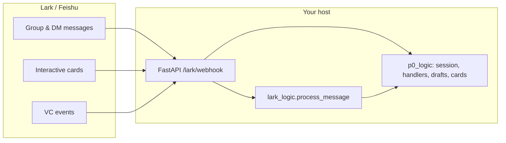
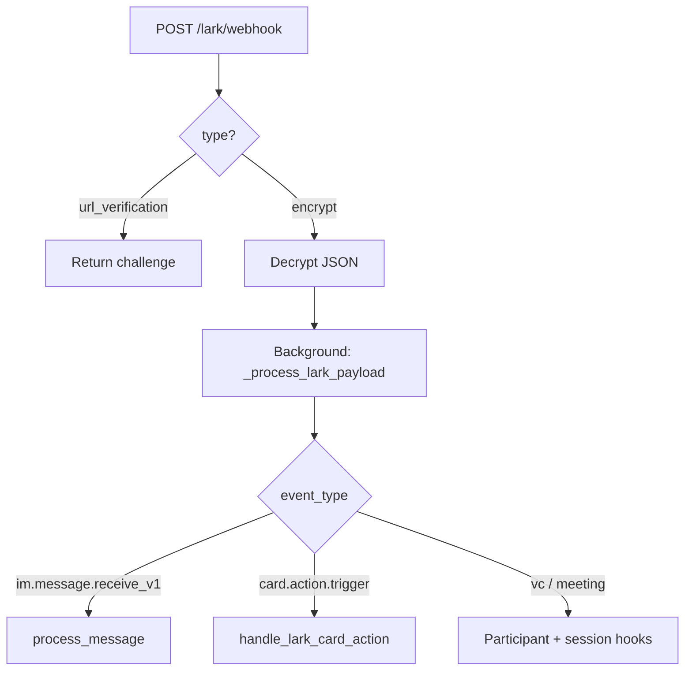
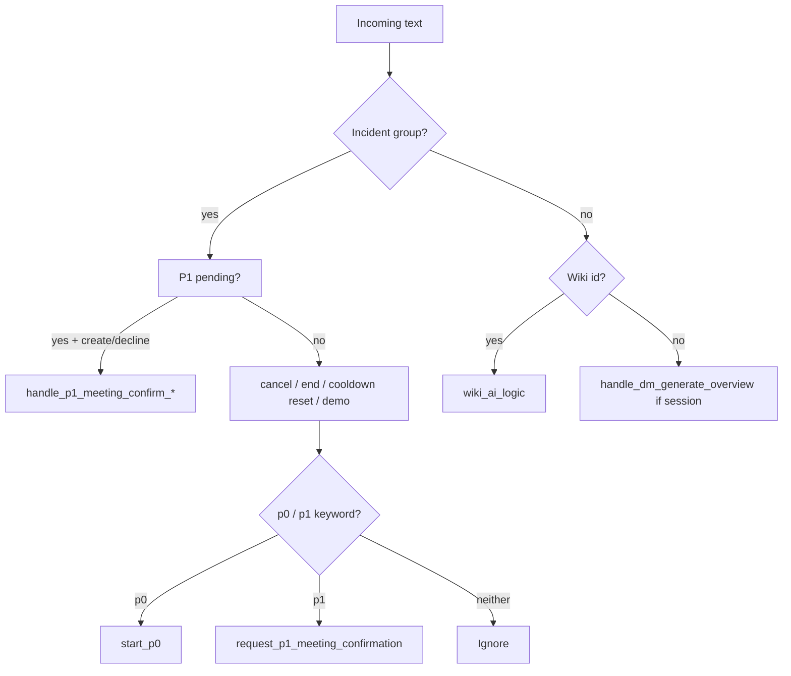
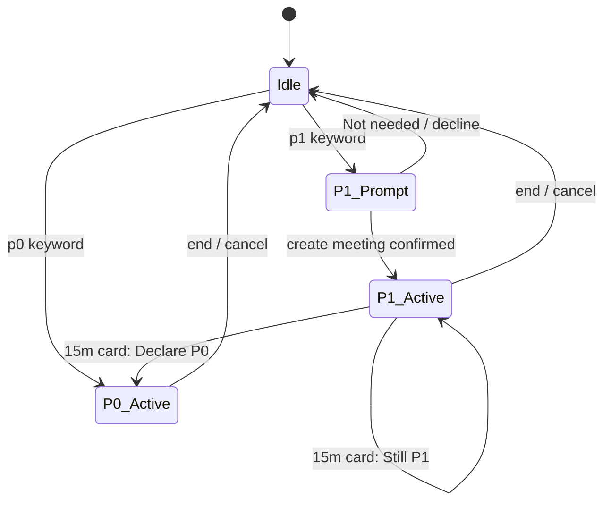
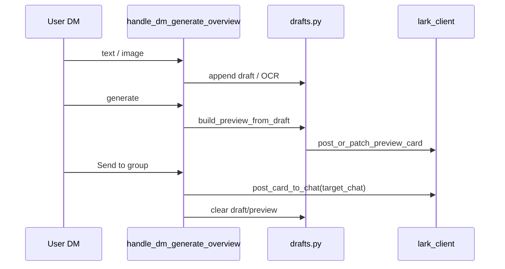

# Architecture & how it runs  
# 架构与运行方式

This document describes **how `lark-ops-ai` is built** (services, modules, data) and **how events flow** from Lark to your code. For **operator steps** (what to type / tap), see **`P0_P1_OPERATOR_GUIDE.md`** and **`HOW_IT_WORKS_AND_NAVIGATION.md`**.

本文说明 **`lark-ops-ai` 如何组成**（服务、模块、数据）以及 **Lark 事件如何进入代码**。**操作步骤**见 **`P0_P1_OPERATOR_GUIDE.md`** 与 **`HOW_IT_WORKS_AND_NAVIGATION.md`**。

---

## 1. Runtime shape | 运行形态

| Piece | Role |
|--------|------|
| **FastAPI** (`main.py`) | HTTP server. Lark sends webhooks to **`POST /lark/webhook`**. |
| **Tenant token** | `p0_logic.lark_client.get_tenant_token` — used for almost all Lark Open API calls. |
| **In-memory state** | Session, drafts, timers live in the **process**. Restart = state lost (except what Lark stores as messages). |



---

## 2. Repository map (main packages) | 代码结构概览

```
lark-ops-ai/
├── main.py              # FastAPI app: decrypt, route events, VC hooks, → process_message / handlers
├── lark_logic.py        # Routes **text** by chat: incident group vs wiki vs DM overview
├── wiki_ai_logic.py     # Wiki group AI (separate from P0)
└── p0_logic/
    ├── session.py       # P0_SESSIONS, start/end/cancel, P1 prompts, timers, cooldown
    ├── handlers.py      # Card button actions (DM preview + P1 group cards)
    ├── drafts.py        # Draft + preview state per user (DM)
    ├── cards.py         # Lark interactive card JSON builders
    ├── lark_client.py   # HTTP helpers (post message, VC reserve, PATCH cards, …)
    ├── config.py        # Env, regex patterns, group IDs, operator allowlist
    ├── participants.py  # VC join/leave → participant list, dept line
    └── …                # groq_client, issues, support, text_processing
```

---

## 3. Webhook entry (`main.py`) | 入口

1. **`url_verification`** — Lark subscription handshake; returns `challenge`.
2. **Encrypted payloads** — optional AES decrypt using `LARK_ENCRYPT_KEY`.
3. **Background task** — `_process_lark_payload` so the HTTP response returns quickly (`code: 0`).
4. **Callback types** (simplified):
   - **IM message** (`im.message.receive_v1`) → extract text/image/post → `process_message(...)`.
   - **`card.action.trigger`** → `handle_lark_card_action(...)`.
   - **VC events** (join/leave/meeting end, …) → update participants / end session by meeting ref, etc.



---

## 4. Text routing (`lark_logic.py`) | 文本路由

Messages are handled in this **order** (incident group):

1. Optional **P1 pending** replies (`create meeting`, `yes`, `not needed`, …) if a P1 prompt is open.
2. **Cancel** (`cancel meeting`, …).
3. **End** (`p0 end`, `p1 end`, …).
4. **Cooldown reset** (`cooldown reset`, `clear cooldown`, …) — clears P0 cooldown only; does **not** start a VC.
5. Demo commands (ongoing / P1-15 demo cards).
6. **P0** keyword → `start_p0` (if no session, not ignored user, …).
7. **P1** keyword → P1 confirmation card + pending state (if no session, …).
8. Otherwise **ignored** in incident group (no reply).

Other chats:

- **Wiki group** (`WIKI_GROUP_CHAT_ID`) → `wiki_ai_logic`.
- **DM / any chat while `P0_SESSIONS` non-empty** → `handle_dm_generate_overview` (draft, OCR, preview).



---

## 5. P0 / P1 session lifecycle (conceptual) | 会话生命周期

- **`P0_SESSIONS[chat_id]`** holds the active incident for that **source** group chat (link, meeting ids, priority, timers, …).
- **P0:** After start → optional ongoing card timer; end/cancel patch or replace cards.
- **P1:** After start → 15‑minute escalation timer → **Declare as P0** / **Still P1** card.
- **P1 first prompt:** Keyword `p1` sets **`P1_PROMPT_PENDING`** and posts a card; user confirms with **typed** `create meeting` / … or button **Not needed** (see current `cards.py`).



---

## 6. DM overview pipeline (`handlers` + `drafts`) | 私聊概览流水线

1. User sends **text** or **images** → stored in **`P0_DRAFTS`** (per `open_id`), tied to **target** incident chat.
2. **Generate / Build overview** → Groq + templates → **`P0_PREVIEWS`** (markdown preview card).
3. **Send to group** → post overview card to `target_chat`, clear draft/preview.
4. Card actions (**Edit**, **Save**, **Cancel preview**) PATCH or recall messages.



---

## 7. Operator restriction (optional) | 操作者限制（可选）

If **`P0_INCIDENT_GROUP_COMMAND_OPEN_IDS`** is set in `.env`, **only those `ou_` users** may use:

- cancel / end meeting, cooldown reset (typed commands),
- P1 prompt responses (typed + **Not needed**),
- **Declare as P0** / **Still P1** buttons.

**Declaring** `p0` / `p1` in the group is **not** gated by this list (unless you use **`P0_TRIGGER_IGNORE_OPEN_IDS`** for separate ignore behavior).

---

## 8. External dependencies | 外部依赖

| Dependency | Use |
|------------|-----|
| **Lark Open Platform** | IM, contacts, VC reserve/apply/end, interactive cards |
| **Groq** (env `GROQ_API_KEY`) | Overview text generation / issue refinement |
| **Env** | See root **`env.example`** — `INCIDENT_GROUP_*`, `P0_*`, `LARK_*`, etc. |

---

## 9. Related docs | 相关文档

| File | Content |
|------|---------|
| `DEPLOYMENT_ARCHITECTURE.md` | VPS, nginx, TLS, systemd, Groq outbound — **production deployment** |
| `HOW_IT_WORKS_AND_NAVIGATION.md` | User-facing clicks and typing paths |
| `P0_P1_OPERATOR_GUIDE.md` | P0/P1 operator SOP-style guide |
| `env.example` | Configuration template |

---

*Diagrams describe behavior intent; exact regex and order are in `lark_logic.py` and `p0_logic/session.py`.*
